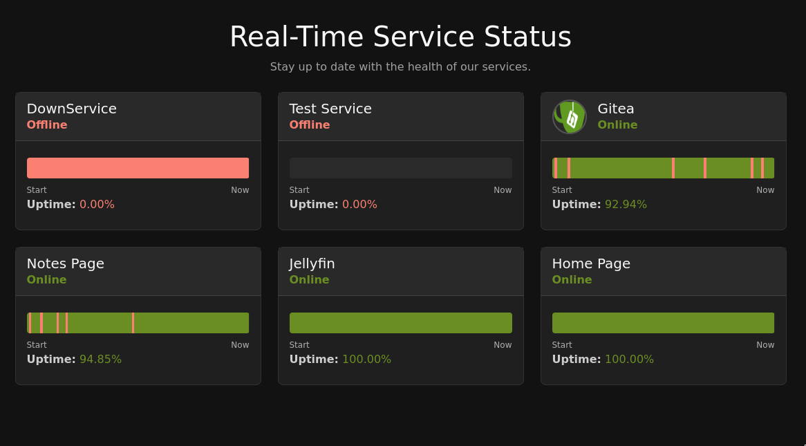
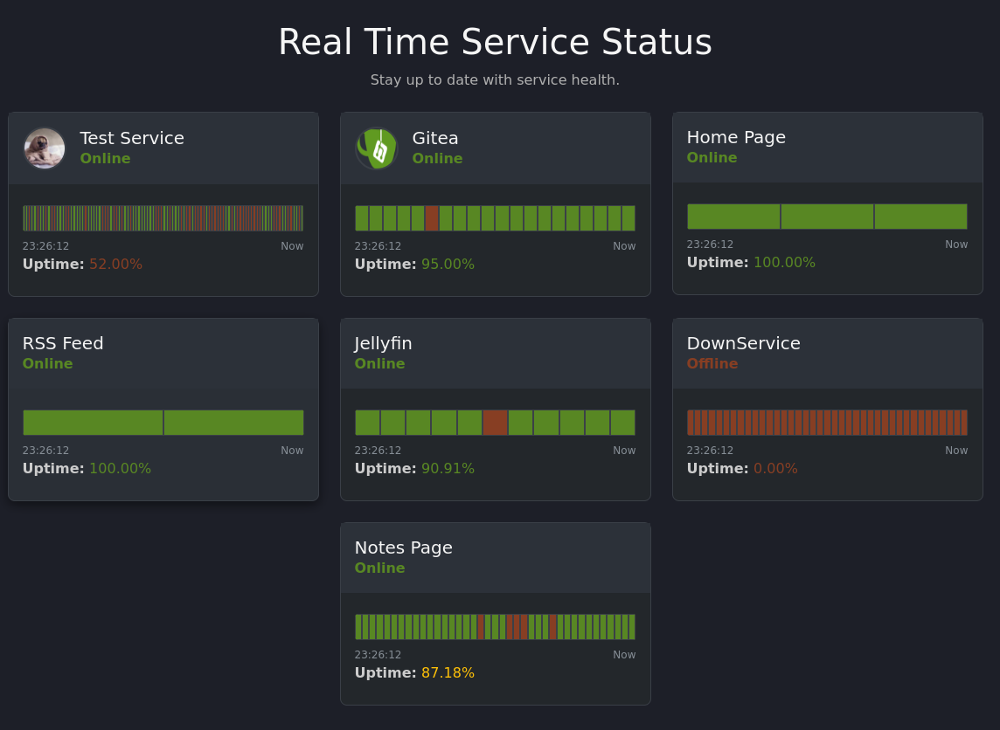

## Sleuth

Sleuth is a simple service monitoring application that uses server side events and htmx in order to reduce network traffic.  Instead of clients constantly pulling the server for updates, the backend sends small segments of the page to swap out as each service has an update.  The project is designed to be easy to get up and running while also maintain some flexible styling via CSS variables. 

---
### How to use
1. Clone this repo.
2. cd into sleuth
3. Edit the config.toml to suit your needs
4. run the command ```make run``` to try to it out. Or build the with ```make production``` then run with "./bin/sleuth"

### Don't want to build from source?
1. Clone the repo.
2. Download a binary from the releases section.
3. Place binary in sleuth/bin/
4. ./bin/sleuth

### Want to use as service on Alpine?
1. I have made an example openrc script to help with convience.
2. Place the script in /etc/init.d/
3. Edit the script to change "owning_dir" to whatever path you placed the git repo
4. Ensure it has executable permissions
5. Run ```rc-update add service sleuth default``` This will start the sleuth on start of your VM
6. Then ```rc-service sleuth start``` in order to start it immediately.

---

### Goals
I made this project because of my desire for a very simple service monitoring application and my desire to be exposed to a handful of new (to me) technologies. Below is a more direct listing of what I am hoping to accomplish.

Goals:
1. Learn/practice Golang as I read through "The Go Programming Language"
    * Create an event driven architecture with a model and view
    * Test out (nested) templating in Golang
    * Test out Level/structured logging
    * Explore Makefile usage with go (shout out to [Alex Edwards](https://www.alexedwards.net/blog/a-time-saving-makefile-for-your-go-projects) for template)
2. Get exposure to the web side of programming
    * Test out HTMX
    * Different update strategies (e.g. sse events, ajax, etc)
    * Trying theming with CSS Variables
    * Learn (enough) bootstrap to have a decent site
3. Apply some Patterns as I re-read "Design Patterns"
4. Build out a service status/health page for homelab use

### Screenshots
Dark Theme


Material Dark Theme


### Ongoing Questions/ Things that "feel" wrong or bad
1. Can I use a struct method inside a template func map?  Or is this only because I am using generics for the ringbuffer? E.g. getAll in ringbuff package and again in service.go
