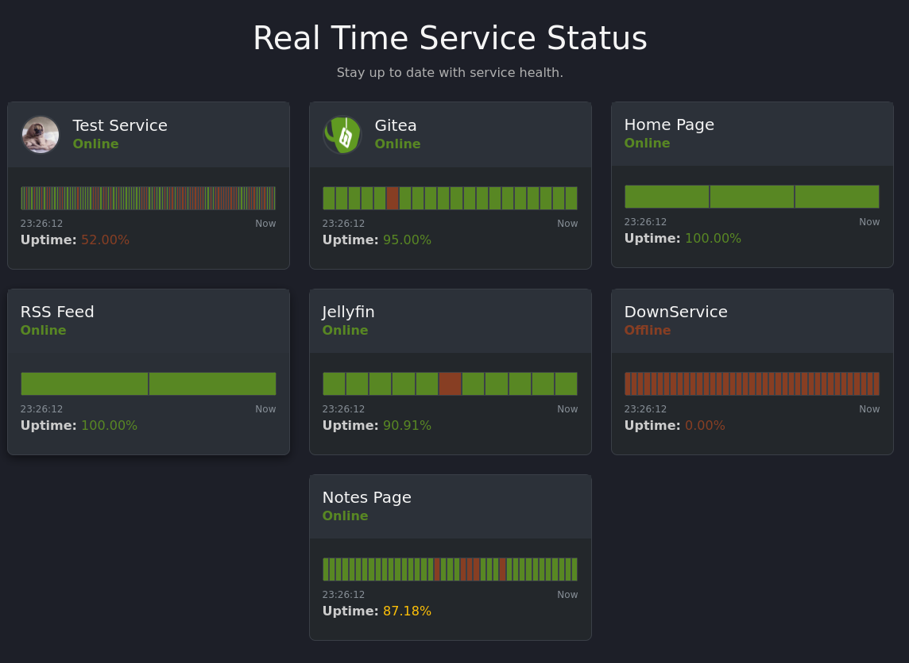
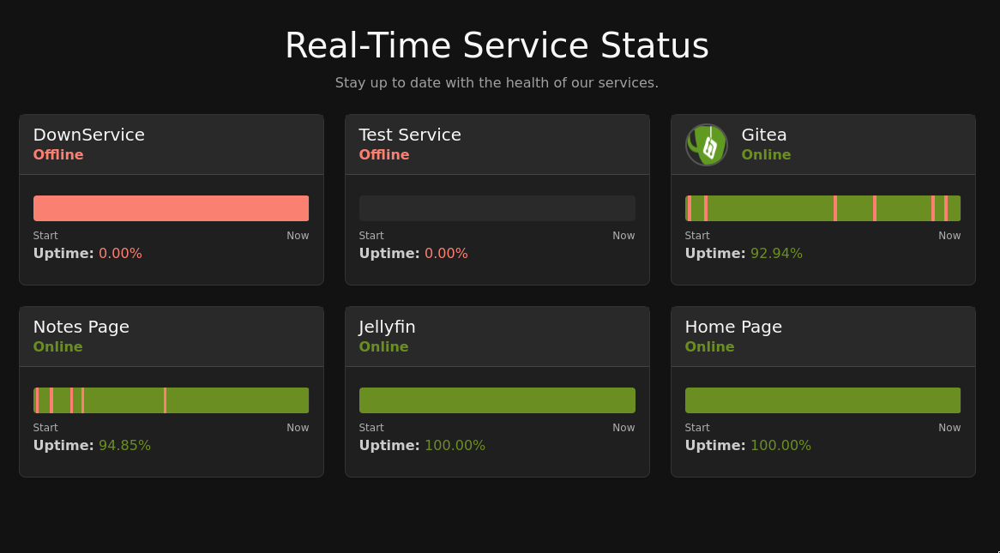

## Sleuth

Sleuth is a lightweight service monitoring application that uses Server-Sent Events and HTMX to push real-time updates to the browser. Instead of polling, the backend sends small HTML fragments to swap in-place as each service check completes. The project is designed to be easy to get running with minimal config, while supporting flexible theming via CSS variables.

---

### Quick start (from source)

1. Clone this repo and `cd` into it.
2. Copy the example config: `cp config.example.toml config.toml`
3. Edit `config.toml` to add your services.
4. `make run` to try it out, or `make production && ./bin/sleuth` to run a release build.

### Quick start (binary release)

Templates and CSS are embedded in the binary, so no repo clone is needed.

1. Download a binary for your platform from the [Releases](../../releases) page.
2. Download `config.example.toml` from the same release, copy it to `config.toml`, and edit it.
3. `./sleuth`

---

### Configuration reference

#### `[server]`

| Key | Default | Description |
|-----|---------|-------------|
| `port` | `5000` | Port to listen on |
| `log_level` | `"warn"` | Log verbosity: `debug`, `info`, `warn`, `error` |
| `theme` | `"material_dark.css"` | CSS file in `static/css/` |
| `title` | — | Page heading |
| `subtitle` | — | Page sub-heading |
| `storage_type` | `"memory"` | Storage backend (only `memory` currently) |
| `cert_file` | — | Path to TLS certificate (optional) |
| `cert_key` | — | Path to TLS private key (optional) |

#### `[[service]]`

| Key | Required | Description |
|-----|----------|-------------|
| `id` | yes | Unique non-zero integer. Used to track history across restarts. |
| `service_name` | yes | Display name on the service card. |
| `address` | yes | `host:port` for TCP/UDP; full URL (`https://…`) for HTTP. |
| `protocol_str` | yes | `TCP`, `UDP`, `HTTP`, or `Test`. |
| `timer` | yes | Probe interval in seconds. |
| `MaxHistory` | no | Ring-buffer size for uptime history. Default: `100`. |
| `link` | no | Makes the service card header a clickable link. |
| `icon` | no | Image source (URL or local path) shown next to the service name. |

##### HTTP-only fields

| Key | Default | Description |
|-----|---------|-------------|
| `http_expected_status` | `0` (any 2xx) | Accept only this exact HTTP status code. Mutually exclusive with `http_expected_category`. |
| `http_expected_category` | `0` (2xx) | Accept any response whose first digit matches (1–5). Mutually exclusive with `http_expected_status`. |
| `http_skip_tls_verify` | `false` | Skip TLS certificate verification. Useful for self-signed certs. |

---

### CLI options

| Flag | Description |
|------|-------------|
| `--no-history` | Start without loading saved uptime history from disk (`.sleuth.bin` is ignored). |

---

### Deploying as a system service

See [DEPLOY.md](DEPLOY.md) for full instructions covering:
- systemd (Linux)
- OpenRC (Alpine)
- TLS configuration
- Reverse proxy setup (nginx / Caddy)
- Config reload without restart (`SIGHUP`)

---

### Screenshots

Material Dark Theme

Dark Theme

---

### Goals

I made this project to scratch a homelab itch and to get hands-on time with a handful of technologies I hadn't used before.

1. **Go** — event-driven architecture, nested templating, structured logging (`slog`), Makefile build pipeline
2. **Web** — HTMX, Server-Sent Events, CSS custom properties for theming, Bootstrap layout
3. **Design Patterns** — Strategy pattern for protocols, pub/sub for SSE fan-out
4. Build a zero-maintenance service status page for homelab use
