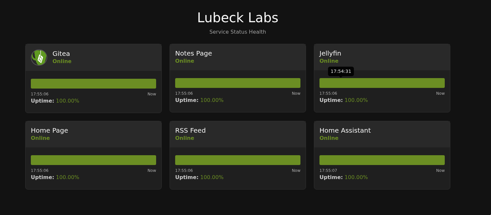
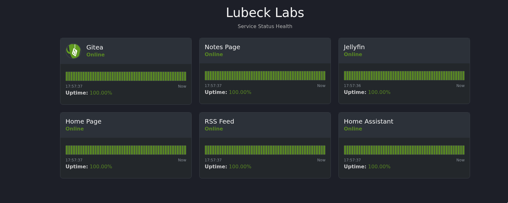

## Sleuth

Sleuth is a simple service monitoring application that is designed to be easy to get up and running and customize to your own liking.

### Goals
I made this project because of my need for a very simple service monitoring application and my desire to be exposed to a handful of new (to me) technologies. Below is a more direct listing of what I am hoping to accomplish.

Goals:
1. Learn/practice Golang as I read through "The Go Programming Language"
    a. Test out templating in Golang
    b. Test out Level/structured logging
    c. Explore Makefile usage with go (shout out to [Alex Edwards](https://www.alexedwards.net/blog/a-time-saving-makefile-for-your-go-projects) for template)
    d. Experiment with the package system (build and use an internal package)
2. Get exposure to the web side of programming
    a. Test out HTMX
    b. Trying theming with CSS Variables
    c. Learn some bootstrap
3. Apply some Patterns as I re-read "Design Patterns"
4. Build out a service status/health page for homelab use

### Screenshots
Dark Theme


Material Dark Theme


---
### How to use
1. Clone this repo.
2. cd into sleuth
3. Edit the config.toml to suit your needs
3. run the command ```make run``` to try to it out. Or build the with ```make production``` then run with "./bin/slueth"

---
### Ongoing Questions/ Things that "feel" wrong or bad
1. Can I not use a struct method inside a template?  Or is this only because I am using generics for the ringbuffer? E.g. getAll in ringbuff package and again in service.go
2. With C I would never create so many threads just to have a timer.  Is this also a bad idea with coroutines?
4. Communication setup feels bad.  Services publish updates through a channel to the scheduler.  Scheduler updates the storage.  Scheduler then forwards event to any clients connected.  This feels overly complicated.
5. Hate how I am duplicating the template for card elements. See service.go::tempateStr()::176-180 and in static/template/homepage.gohtml Partially because service side events use newlines to end the message.  Still a better solution should be used.
6. Better way to marshal/unmarshal configs? See main.go::36-39
7. How would you deploy something like this with so many template files and file structure?
6. Giving css variables root tag seems weird.
